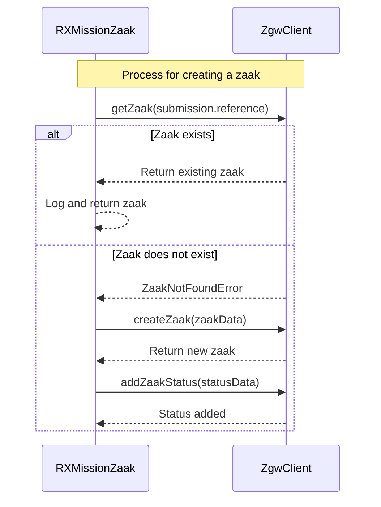
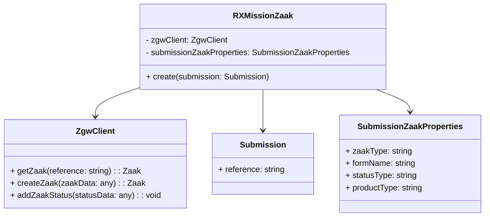
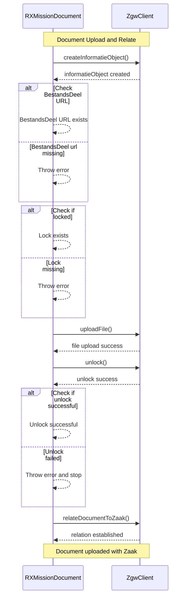
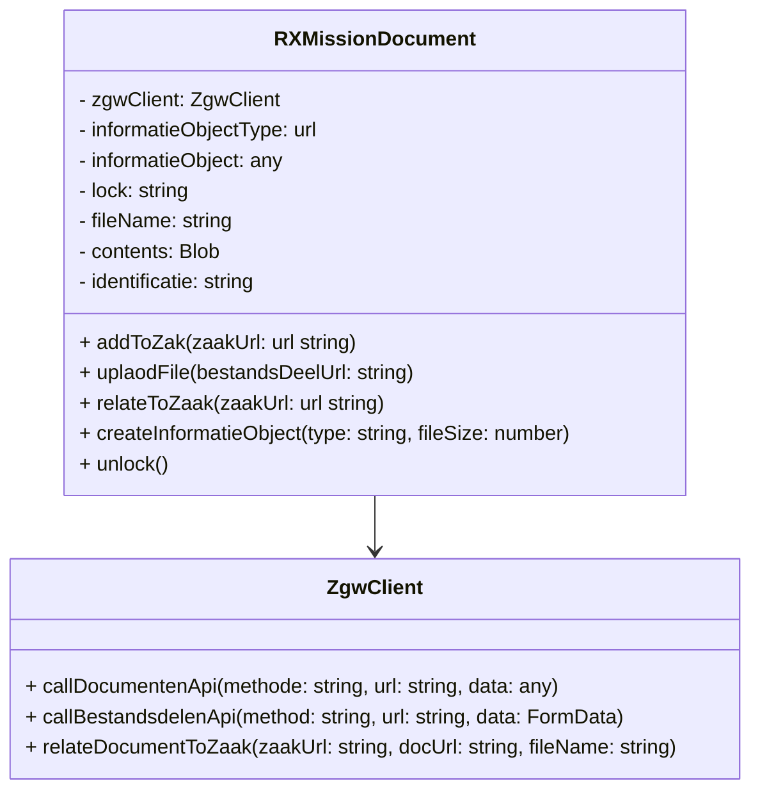

### Ongoing Issues & Questions
- [ ] Product bij zaak toevoegen in productenEnDiensten[]?
- [ ] Verwachte velden in rol in relatie tot betrokkene
- [ ] [Zaakeigenschappen](#zaakeigenschappen) of zaakobjecten voor extra velden
- [ ] [Informatieobjecttypen](#informatieobjecttypen) aanvraag is een duidelijke, maar voor de extra bijlagen, moet dit ook op aanvraag?

### Zaak ZGW aanmaken RxMission

#### Idempotency in Zaak Creation

##### Problem
Duplicate zaken may be created during retries because:
- The ZGW API, GET Zaak and GET zaakeigenschap, relies on `zaakUrl` or `zaak UUID` for identification.
- `submission.reference` (formulierkenmerk) is unique but not preferred as the primary identifier.

##### First Solution: Discuss with RxMission
- **Action**: Engage with RxMission to clarify why `submission.reference` (formulierkenmerk), which is known to be unique, cannot be reliably used for zaak identification.
- **Goal**: Resolve potential issues and enable the use of `formulierkenmerk` as the primary key for identifying zaken in retry scenarios.

##### Alternative Solutions
1. **Persist Zaak URL/UUID**:
   - Store the `zaakUrl` or `zaak UUID` after creation for retry checks.
2. **Custom Idempotency Token**:
   - Use `submission.reference` as an idempotency key in API calls to ensure retries return the same zaak.

##### Finding a Zaak: Available Query Parameters
- **Endpoint**: [GET /zaken](https://vng-realisatie.github.io/gemma-zaken/standaard/zaken/redoc-1.5.1#operation/zaak_list)
- **Available Query Parameters**:
  - `identificatie`: A unique identifier for the zaak.
  - `startdatum`: The start date of the zaak.
  - `einddatum`: The end date of the zaak.
  - `zaaktype`: The zaak type URL.
  - `omschrijving`: Description of the zaak.
  - `bronorganisatie`: Organization responsible for the zaak.

##### Limitation: Querying Zaakeigenschappen
- **Endpoint**: [GET /zaakeigenschappen](https://vng-realisatie.github.io/gemma-zaken/standaard/zaken/redoc-1.5.1#operation/zaakeigenschap_list)
- **Requirement**: Requires the `zaak UUID` to retrieve zaak properties.
- **Impact**: Without the UUID, retrieving zaakeigenschappen is not possible, complicating retry and identification processes.

##### Summary
Priority is to explore with RxMission the feasibility of using `submission.reference` (formulierkenmerk) as the unique identifier for zaken. If this is not viable:
1. Use `zaakUrl` or `zaak UUID` to ensure accurate retry handling.
2. Explore custom idempotency mechanisms to prevent duplicate zaken.

### Document ZGW aanmaken RxMission
RxMissionDocument called from RxMissionZgwHandler

### Zaakeigenschappen
Huidige lijst zaakeigenschappen /api/v1/eigenschappen preprod

- **Indicatie informeren** - Indicatie of de melder informatie wil ontvangen over de behandeling van de melding.
- **Omsch overlast** - Omschrijving van de (over)last die de melder ondervindt van het incident.
- **Uitkomst** - De uitkomst van de behandeling van het bezwaar.
- **Projectnummer** - Uniek nummer van het project waarop de zaak betrekking heeft.
- **Zittingsdatum** - De datum en het tijdstip van de zitting waarin het verweer gevoerd moet worden.
- **Wet of besluit** - Aanduiding van de wet of het besluit dat op de gemelde activiteit ziet.
- **Zaaknummer Corsa** - Zaaknummer in Corsa (Gemeente Nijmegen).
- **Samenloop** - Indicatie of het adviesonderwerp betrekking heeft op samenloop en zo ja, wie het bevoegd gezag is.
- **Uitkomst beoordeling** - Het oordeel dat het resultaat is van de beoordeling.
- **Bestuurlijk gevoelig** - De bestuurlijke gevoeligheid van de zaak.
- **Datum overleg** - De datum waarop het (laatste) overleg waarop het advies betrekking heeft, heeft plaatsgevonden.
- **Einddatum** - De datum waarop de voorgenomen activiteit niet meer wordt uitgevoerd.
- **Uitkomst behandeling** - De uitkomst van behandeling van de melding.
- **Urgentie** - Aanduiding van de prioriteit waarmee het incident of de gevolgen daarvan behandeld moeten worden.
- **Indicatie anoniem** - Indicatie of de melding anoniem is gedaan.
- **Voornemen** - Maatregel die is aangekondigd in het handhavingsvoornemen vanwege overtreding van rechtsregels.
- **Tijdstip melding** - Het tijdstip waarop de melding gedaan is.
- **Veroorzaker** - Gegevens van degene waarvan de melder vermoedt dat dat de veroorzaker van het incident is.
- **Sanctie** - Maatregel die wordt toegepast vanwege overtreding van rechtsregels.
- **Uitkomst advies** - Classificatie van de strekking van het gegeven advies.

### informatieobjecttypen 
Bij Aanvraag beschikking behandelen preprod

- Bijlage bij omgevingsoverleg - URL: https://catalogi.preprod-rx-services.nl/api/v1/informatieobjecttypen/003e6470-ae14-41e4-8315-ba03a5a252bd
- Aankondiging controle - URL: https://catalogi.preprod-rx-services.nl/api/v1/informatieobjecttypen/007b4976-8d8d-449f-a444-642191cbd867
- Tussenuitspraak - URL: https://catalogi.preprod-rx-services.nl/api/v1/informatieobjecttypen/027f3a36-d8c6-4980-a1ee-4d63aae78af7
- Verslag horen - URL: https://catalogi.preprod-rx-services.nl/api/v1/informatieobjecttypen/043daecd-31b9-4515-a323-6a4cbc183ddf
- Verslag onderzoek - URL: https://catalogi.preprod-rx-services.nl/api/v1/informatieobjecttypen/059ddad9-ed4a-4678-828d-d416797b58e8
- Verzoek aanvullende stukken - URL: https://catalogi.preprod-rx-services.nl/api/v1/informatieobjecttypen/07e08ac9-9ede-4dce-8f2a-4ce3d7927313
- Beschikking niet vergunning- of ontheffingplichtig - URL: https://catalogi.preprod-rx-services.nl/api/v1/informatieobjecttypen/08b3903a-31de-433d-a18b-bb2a947edb11
- Mededeling hersteld besluit - URL: https://catalogi.preprod-rx-services.nl/api/v1/informatieobjecttypen/0a68951c-f311-4b47-9e19-daa0f36fc1fd
- Verzoek verlenging termijn opstellen verweerschrift - URL: https://catalogi.preprod-rx-services.nl/api/v1/informatieobjecttypen/0ae0e4c8-9e11-4730-b196-f7950ad30fcd
- Incidentmelding - URL: https://catalogi.preprod-rx-services.nl/api/v1/informatieobjecttypen/0b2d0833-8414-4985-b3ad-81c649a7199c
- Voornemen kostenverhaalbeschikking - URL: https://catalogi.preprod-rx-services.nl/api/v1/informatieobjecttypen/5151f042-9987-4ef2-b369-dc0f143376c3
- Programma van eisen en wensen - URL: https://catalogi.preprod-rx-services.nl/api/v1/informatieobjecttypen/52922cf4-9fd9-4222-b531-4fbc380c4874
- Verzoek om aanpassing initiatief - URL: https://catalogi.preprod-rx-services.nl/api/v1/informatieobjecttypen/55f0918d-307e-42f6-8530-7cf074b821e1
- Indicatorenlijst openbare inrichtingen - URL: https://catalogi.preprod-rx-services.nl/api/v1/informatieobjecttypen/56bc52a9-31ad-4c1b-ad5d-45e141c37d99
- Bericht van intrekking - URL: https://catalogi.preprod-rx-services.nl/api/v1/informatieobjecttypen/57fea2b2-12ce-4a48-a32a-f301a5196534
- Verzoek om voorlopige voorziening - URL: https://catalogi.preprod-rx-services.nl/api/v1/informatieobjecttypen/59417537-7fcd-466e-a75e-e753a585e624
- Advies van Adviescommissie Bezwaar(schriften) - URL: https://catalogi.preprod-rx-services.nl/api/v1/informatieobjecttypen/5a6e523d-5fba-4fe1-896d-5d62d349bccf
- Verlenging termijn opstellen verweerschrift - URL: https://catalogi.preprod-rx-services.nl/api/v1/informatieobjecttypen/5cc80b5e-85a8-4667-b086-6d93d649c304
- Proces-verbaal meevoeren en opslaan van zaken - URL: https://catalogi.preprod-rx-services.nl/api/v1/informatieobjecttypen/5da4f06c-31eb-4e6b-b17c-34be1ff34c96
- Bericht afhandeling melding - URL: https://catalogi.preprod-rx-services.nl/api/v1/informatieobjecttypen/5e865015-176c-4c6d-aaa6-2a1d9b615330
- Adviesrapport - URL: https://catalogi.preprod-rx-services.nl/api/v1/informatieobjecttypen/9cb39b27-1ae5-42d3-b1f7-1016372378bc
- Bezoeknotitie - URL: https://catalogi.preprod-rx-services.nl/api/v1/informatieobjecttypen/9e7144d9-20af-4743-a636-c342c3cc5738
- Uitnodiging horen - URL: https://catalogi.preprod-rx-services.nl/api/v1/informatieobjecttypen/9fac5328-e231-42ee-9641-40359ef22707
- Participatie-advies - URL: https://catalogi.preprod-rx-services.nl/api/v1/informatieobjecttypen/a05275cc-589b-407a-bc8a-2de01741ec34
- Eindbrief - URL: https://catalogi.preprod-rx-services.nl/api/v1/informatieobjecttypen/a0e972e8-23cf-48ae-a6f7-312410bf9041
- Kennisgeving bestuursdwang - URL: https://catalogi.preprod-rx-services.nl/api/v1/informatieobjecttypen/a216aebd-4c1c-4137-85a7-ae7dd096296d
- Kennisgeving (ontwerp)besluit - URL: https://catalogi.preprod-rx-services.nl/api/v1/informatieobjecttypen/a21c7ad6-2ffb-4455-9688-c49eb5cc6a62
- Zienswijzereactie - URL: https://catalogi.preprod-rx-services.nl/api/v1/informatieobjecttypen/a27d5d52-9910-4186-a209-36fef563e9a3
- Bestuurlijke strafbeschikking - URL: https://catalogi.preprod-rx-services.nl/api/v1/informatieobjecttypen/a3184f5e-03fd-48c8-a483-9a354e9e3fa7
- Reactie op verweerschrift (repliek) - URL: https://catalogi.preprod-rx-services.nl/api/v1/informatieobjecttypen/a549d60e-bfb4-40f8-8104-3b2f750ae9db
- Participatieverslag - URL: https://catalogi.preprod-rx-services.nl/api/v1/informatieobjecttypen/aaad2cb2-d3d7-4c36-b377-0480042cba44
- Uitnodigen tot geven zienswijze - URL: https://catalogi.preprod-rx-services.nl/api/v1/informatieobjecttypen/adb492a3-24f4-4e32-af05-3ac42b8d71ff
- Aankondiging toepassing bestuursdwang - URL: https://catalogi.preprod-rx-services.nl/api/v1/informatieobjecttypen/aee42f58-7f5c-40c4-8ef5-22ab3594bec3
- Uitnodiging zitting - URL: https://catalogi.preprod-rx-services.nl/api/v1/informatieobjecttypen/af018be1-fa7b-40fd-a8bc-6d1808348adf
- Aanvraag - URL: https://catalogi.preprod-rx-services.nl/api/v1/informatieobjecttypen/b222fce5-5ebf-4f6e-83a6-3ded759d2b59
- Adviesaanvraag - URL: https://catalogi.preprod-rx-services.nl/api/v1/informatieobjecttypen/b2c428f6-b13d-4ee4-bd0b-c512072fc950
- Bericht ander bevoegd gezag - URL: https://catalogi.preprod-rx-services.nl/api/v1/informatieobjecttypen/e7ab8f17